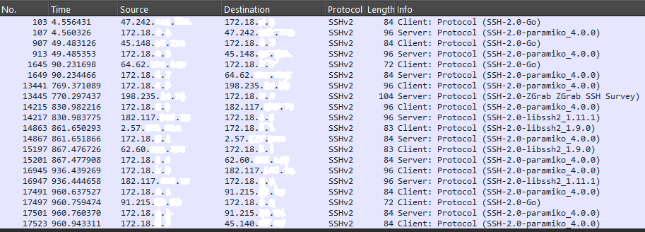

# 📑 ShadowShell: Reporte de Inteligencia de Amenazas
**Fecha del Despliegue:** 30/12/2025
**Duración:** 72 Horas
**Entorno:** VPS Cloud (Expuesto a Internet)

## 1. Resumen Ejecutivo
Durante un periodo de vigilancia de 72 horas, el sensor ShadowShell detectó y neutralizó **+790 intentos de intrusión**. El tráfico provino de **39 actores únicos** distribuidos globalmente. La actividad detectada confirma un alto nivel de automatización (Botnets) buscando vulnerabilidades tanto en servicios de infraestructura (SSH) como en aplicaciones web (HTTP).

El hallazgo más crítico fue la detección de **Malware tipo "Infostealer"**, diseñado específicamente para exfiltrar sesiones de Telegram y tokens de autenticación, descartando la teoría de que "solo buscan minar criptomonedas".

---

## 2. Hallazgos Críticos (Deep Dive)

### 🚨 A. El Cazador de Telegram (Infostealer)
Se interceptó un payload altamente específico ejecutado por la IP `182.117.xx.xx`. A diferencia de los scripts comunes de minería, este script buscaba rutas de archivos locales asociadas a mensajería privada y 2FA.

**Comando Interceptado:**
```bash
ls -la ~/.local/share/TelegramDesktop/tdata /var/spool/sms/* /var/log/smsd.log
```
**Análisis**:

    Objetivo: Robar la carpeta tdata (Sesión activa de Telegram) y logs de demonios SMS.

    Impacto: Permite al atacante secuestrar la cuenta de Telegram y bypassear la autenticación de dos factores (2FA) basada en SMS sin necesidad de contraseña.

### 🛠️ B. Campaña Masiva contra Routers (Credential Stuffing)
El 35% de los intentos de autenticación SSH no utilizaron los usuarios estándar root o admin. Se detectó una campaña dirigida utilizando las credenciales support / support.

Origen Principal: `91.215.xx.xx` (Rusia).

Objetivo: Dispositivos IoT y Routers industriales que suelen tener cuentas de soporte "backdoor" habilitadas por defecto.

### ⚔️ C. Guerra de Recursos (Miner Killers)
Varios atacantes ejecutaron comandos de limpieza antes de intentar instalar su propio software. 
**Comando**: 
```bash 
ps -ef | grep '[Mm]iner' 
```
**Análisis**: Los atacantes asumen que el servidor ya está comprometido por una botnet rival. Escanean procesos de minería existentes para "matarlos" y liberar CPU para su propio minero.

### 🕵️‍♂️ D. Correlación de Vectores (SSH + Web)
Se identificó a la IP `91.224.xx.xx` atacando simultáneamente por dos vectores:

**Web (Puerto 80)**: Explotación de vulnerabilidad en /goform/formJsonAjaxReq.

**SSH (Puerto 2222)**: Ejecución de comandos de reconocimiento. Esto indica un escáner de vulnerabilidades avanzado buscando cualquier punto de entrada disponible.

### 🤖 E. Análisis de Infraestructura (Fingerprinting)
La inspección profunda de paquetes (DPI) en el tráfico SSH reveló que el **80% de las conexiones** no provienen de clientes humanos (como OpenSSH o PuTTY), sino de librerías de automatización y botnets.

**Firmas Detectadas (SSH Handshake):**
* `SSH-2.0-Go`: Indicativo de botnets modernas (variantes de Mirai) escritas en Go para concurrencia masiva.
* `SSH-2.0-ZGrab`: Herramienta de escaneo masivo utilizada frecuentemente para mapear internet (detectada en `traffic.pcap2`).
* `SSH-2.0-libssh2`: Librería común en scripts de fuerza bruta Python/C.



### 3. Indicadores de Compromiso (IOCs) top
<table> <thead> <tr> <th>IP (Masked)</th> <th>País</th> <th>Severidad</th> <th>Comportamiento</th> </tr> </thead> <tbody> <tr> <td>182.117.xx.xx</td> <td>PK</td> <td><span style="color:red; font-weight:bold;">CRÍTICO</span></td> <td>Intento de robo de sesión Telegram / SMS</td> </tr> <tr> <td>91.215.xx.xx</td> <td>RU</td> <td><span style="color:orange; font-weight:bold;">ALTO</span></td> <td>Fuerza bruta masiva (User: support)</td> </tr> <tr> <td>130.12.xx.xx</td> <td>US</td> <td><span style="color:goldenrod; font-weight:bold;">MEDIO</span></td> <td>Descarga de scripts (Wget / Curl)</td> </tr> <tr> <td>91.224.xx.xx</td> <td>DE</td> <td><span style="color:goldenrod; font-weight:bold;">MEDIO</span></td> <td>Ataque Multi-vector (Web + SSH)</td> </tr> </tbody> </table>

### 4. Conclusión Técnica
El despliegue de ShadowShell demostró que los servidores expuestos a internet son atacados en cuestión de minutos. La sofisticación de los comandos (búsqueda de tdata, limpieza de procesos) sugiere que las botnets modernas han evolucionado de la simple minería hacia el robo de identidad y el espionaje automatizado.

Reporte generado automáticamente por ShadowShell Intelligence Module.